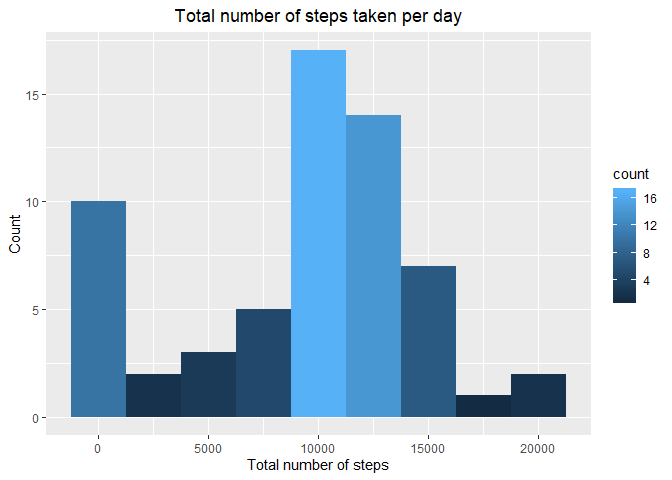
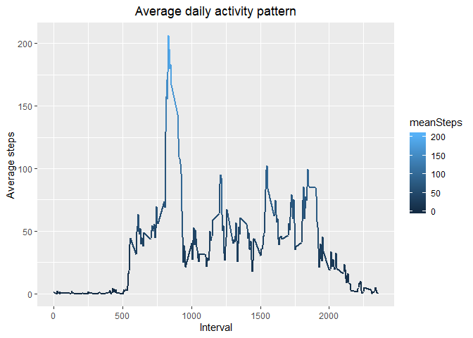
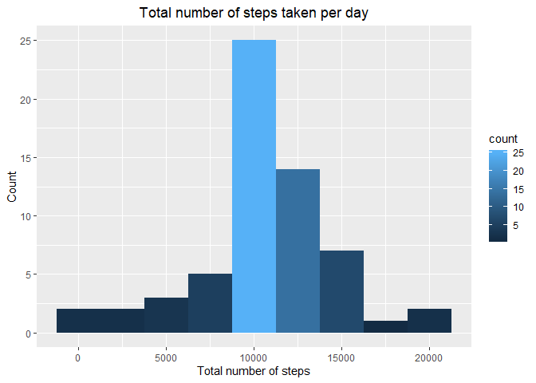
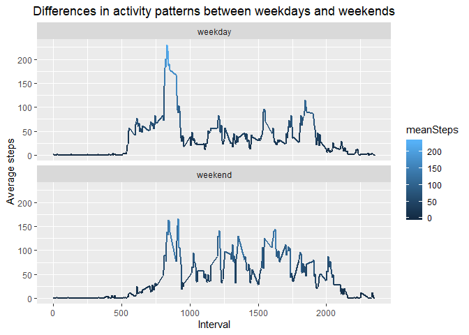

## Load libraries and source functions

```r
library(ggplot2)
library(dplyr)
```

```
## 
## Attaching package: 'dplyr'
```

```
## The following objects are masked from 'package:stats':
## 
##     filter, lag
```

```
## The following objects are masked from 'package:base':
## 
##     intersect, setdiff, setequal, union
```

## Create directories if they don't exist

```r
if(!file.exists("./data")){dir.create("./data")}  # Create data dir if it doesn't exist
if(!file.exists("./figures")){dir.create("./figures")}  # Create data dir if it doesn't exist
if(!file.exists("./data/activity.csv")){  # Unzip data
        unzip("./activity.zip", exdir = "./data")
} 
```

## Loading and preprocessing the data
These chunks of code performs the following tasks: 

1. Load the data (i.e. read.csv())  


```r
activity <- read.csv("./data/activity.csv")
```

2. Process/transform the data into a format suitable for the analysis


```r
# Converts the data.frame into a tibble object and format "date" as date format.
activityFormat <- activity %>% tbl_df() %>% mutate(
        date = as.Date(as.character(date)))    
```


## What is mean total number of steps taken per day?
For this part of the assignment, we'll assess the mean total number of steps taken
per day. With this purpose, we will perform the following tasks:  

### Make a histogram of the total number of steps taken each day
First, we will group our data by date: 


```r
by_date <- group_by(activityFormat, date)
```
Then, we'll summarise the data according to the date:


```r
totalSteps_by_date <- summarise(by_date, totalSteps = sum(steps, na.rm = TRUE))
```
As you can see next, the **mean and median of the total number of steps taken 
per day**:

```r
data.frame(meanSteps=mean(totalSteps_by_date$totalSteps), 
                                medianSteps=median(totalSteps_by_date$totalSteps))
```

```
##   meanSteps medianSteps
## 1   9354.23       10395
```

Finally, we make the histogram and save it as png file:


```r
g <- ggplot(totalSteps_by_date, aes(totalSteps, fill=..count..))
g + geom_histogram(binwidth = 2500) + labs( x = "Total number of steps", 
                                            y = "Count",
                                            title = "Total number of steps taken per day") +
        theme(plot.title = element_text(hjust = 0.5))
```

<!-- -->

```r
dev.copy(png, "./figures/TotalNumberStepsDay.png")
```

```
## png 
##   3
```

```r
dev.off()
```

```
## png 
##   2
```


2. Calculate and report the mean and median total number of steps taken
per day


## What is the average daily activity pattern?
For this part of the assignment, we'll assess the average daily activity pattern.
With this purpose, we will perform the following tasks:  

### Group data by interval
In this case, we'll group the data by interval:

```r
by_interval <- group_by(activityFormat, interval)
```
### Summarise data according to the interval
Next, we compute de average steps for each interval:

```r
averageSteps_by_interval <- summarise(by_interval, 
                                      meanSteps = mean(steps, na.rm = TRUE))
```
### Compute the maximum interval
Then, we filter the data to get the **interval with the maximum number of steps**:

```r
maxInterval <- filter(averageSteps_by_interval, 
                      meanSteps == max(meanSteps, na.rm = TRUE))
maxInterval
```

```
## # A tibble: 1 x 2
##   interval meanSteps
##      <int>     <dbl>
## 1      835      206.
```
### Plot and save the average daily activity pattern
Finally, we plot and save the histofram of the average daily activity pattern:

```r
g <- ggplot(averageSteps_by_interval, aes(interval, meanSteps, color = meanSteps))
g + geom_line(size = 1) + labs( x = "Interval", y = "Average steps",
                                title = "Average daily activity pattern") +
        theme(plot.title = element_text(hjust = 0.5))
```

<!-- -->

```r
dev.copy(png, "./figures/AverageNumberStepsAllDay.png")
```

```
## png 
##   3
```

```r
dev.off()
```

```
## png 
##   2
```


## Imputing missing values
In this part we will impute a average number of steps to the missing cases. 
First lets see how manyincomplete cases do we have:

```r
sum(!complete.cases(activityFormat)) # Number of rows with NA
```

```
## [1] 2304
```
### Compute the mean steps for each interval
Next, as we already have our data groupd by interval, lets computed the average 
number of steps for each one:

```r
meanInterval <- summarise(by_interval, 
                          mean = mean(steps, na.rm = TRUE))
```
### Impute the mean value for each interval 
Then, we impute the average number of steps to the missing cases. With that purpose,
first we have to obtain the indixes of the incomplete cases:

```r
activityImputed <- activityFormat
incompleteCases <- which(!complete.cases(activityImputed))
for (idx in incompleteCases){
        idxInterval <- which(meanInterval$interval == activityImputed[[idx, 3]])
        activityImputed[idx, 1] <- meanInterval[idxInterval, 2]
}
```
### Group data by date
Now, we can group the our new data with imputed values by date again:

```r
by_date_imputed <- group_by(activityImputed, date)
```
### Summarise data according to the date
And calculate the **mean and median total steps** to see if they ahve changed:

```r
totalSteps_by_date_imputed <- summarise(by_date_imputed, totalSteps = sum(steps, na.rm = TRUE))
data.frame(meanSteps=mean(totalSteps_by_date_imputed$totalSteps), 
                                medianSteps=median(totalSteps_by_date_imputed$totalSteps))
```

```
##   meanSteps medianSteps
## 1  10766.19    10766.19
```
As you can see, they have.

### Plot and save histogram of the steps taken by day
Finally we plot and save the histogram as before:


```r
g <- ggplot(totalSteps_by_date_imputed, aes(totalSteps, fill=..count..))
g + geom_histogram(binwidth = 2500) + labs( x = "Total number of steps", 
                                            y = "Count",
                                            title = "Total number of steps taken per day") +
        theme(plot.title = element_text(hjust = 0.5))
```

<!-- -->

```r
dev.copy(png, "./figures/TotalNumberStepsDay_NoNA.png")
```

```
## png 
##   3
```

```r
dev.off()
```

```
## png 
##   2
```


## Are there differences in activity patterns between weekdays and weekends?
In this section, we'll calculate the differences in activity patterns between 
weekdays and weekends.

### Create a new factor variable in the dataset with two levels – “weekday” and “weekend”
First, we have to create a neww factor variable with two levels (i.e. "weekend" 
for Saturday and Sunday, and "weekday" for the rest). Then we include this new 
variable to our imputed data as variable "day":

```r
activityWeekDays <- weekdays(activityImputed$date)
weekends <- activityWeekDays == "Saturday" | activityWeekDays == "Sunday"
activityWeekDays[weekends] <- "weekend"
activityWeekDays[!weekends] <- "weekday"
activityImputed$day <- as.factor(activityWeekDays)
```
### Group data by day
Next, we group our data by this new factor variable:


```r
activityImputed_by_day <- group_by(activityImputed, day, interval)
```
### Summarise data
Then, we compute the average steps for weekdays and weekends:

```r
averageSteps_by_day <- summarise(activityImputed_by_day, 
                                      meanSteps = mean(steps, na.rm = TRUE))
```
### Create and save time series plot
Finally, que create a time series plot to see the differences per interval:

```r
g <- ggplot(averageSteps_by_day, aes(interval, meanSteps, color = meanSteps))
g + geom_line(size = 1) + facet_wrap(day ~ ., nrow=2) +
        labs( x = "Interval", y = "Average steps",
                                title = "Differences in activity patterns between weekdays and weekends") +
        theme(plot.title = element_text(hjust = 0.5))
```

<!-- -->

```r
dev.copy(png, "./figures/DifferencesActivityPatternsWeekday.png")
```

```
## png 
##   3
```

```r
dev.off()
```

```
## png 
##   2
```
